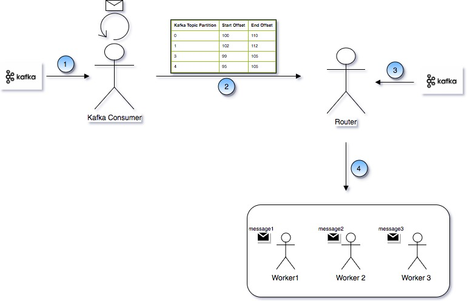

## Back Pressure and its benifits

All event based applications need to have an important feature of back pressure. The reason is simple, If application processing rate is slower than the rate of its consumption, it can cause following problems:

1. Application may crash because the of memory exceeding from a limit. Which will eventually become the reason to loose all events which have been consumed
2. Even if application is stopped in that case also all the messages will be lost.

So it is very much important, application should be able to limit the message in-take rate, so that messages can reside at message source/broker instead of getting consumed. This is called Back Pressure.

## Farmeworks enabled with Back Pressure
There are farmeworks like Spark Streaming and Akka Streaming which have back pressure feature available. Spark Streaming which is based on Lmabda Architecture and AKKA Streaming which is based on KAPPA Architecture, in both we can make sure that while implementing a pipeline, we can limit the rate at which we want to consume the messages.

## Back Pressure with AKKA Actor and Kafka

### Application Design and flow

Following diagram represents the design of AKKA Actor based processing framework and KAFKA as messaging broker. 



### Working and Implementation

Above diagram contains following Actors:

1. Ticker Actor
2. WorkerRouter Actor 
3. Worker Actor

### Ticker Actor 

This is the actor which uses Kafka High Level Consumer API. It uses **createKafkaConsumer** function as shown in following code snnipet. Here the important point to be noted is, consumer group is required here.

```scala
object KafkaUtil {
  def createKafkaConsumer(properties: Properties): KafkaConsumer[String, String] = {
    val props = new Properties()
    props.put("bootstrap.servers", properties.getProperty(ConfigConstants.KAFKA_BOOT_SERVERS))
    props.put("group.id", properties.getProperty(ConfigConstants.KAFKA_GROUP_ID))
    props.put("auto.offset.reset", "latest")
    props.put("enable.auto.commit", "false")
    props.put("key.deserializer", "org.apache.kafka.common.serialization.StringDeserializer")
    props.put("value.deserializer", "org.apache.kafka.common.serialization.StringDeserializer")
    val consumer = new KafkaConsumer[String, String](props)
    consumer.subscribe(properties.getProperty(ConfigConstants.KAFKA_TOPIC).split(",").toList.asJava)
    consumer
  }

  def createKafkaConsumer2(properties: Properties): KafkaConsumer[String, String] = {
    val props = new Properties()
    props.put("bootstrap.servers", properties.getProperty(ConfigConstants.KAFKA_BOOT_SERVERS));
    props.put("auto.offset.reset", "latest");
    props.put("enable.auto.commit", "false");
    props.put("key.deserializer", "org.apache.kafka.common.serialization.StringDeserializer");
    props.put("value.deserializer", "org.apache.kafka.common.serialization.StringDeserializer");
    val consumer = new KafkaConsumer[String, String](props)
    consumer
  }  
}
```
Ticker Actor does not actually consumes the message but it finds out the current offset and latest offset of the corresponding KAFKA Topic. Limits the number of messages to be consumed. See the receive method which uses a function called 
**consumeLimitedBatch()** which is explained latter.

```scala
object Ticker {
  def props(properties: Properties, consumer: KafkaConsumer[String, String]) = Props(new Ticker(properties, consumer))
}

class Ticker(properties: Properties, consumer: KafkaConsumer[String, String]) extends Actor with Timers with ActorLogging {
	timers.startSingleTimer(TickKey, Tick, ConfigConstants.START_TICK_INTERVAL.seconds)
	protected var currentOffsets = Map[TopicPartition, Long]()

	override def preStart = {
    		val c = consumer
    		paranoidPoll(c)
    		if (currentOffsets.isEmpty) {
      			currentOffsets = c.assignment().asScala.map { tp =>
        			tp -> c.position(tp)
      			}.toMap
    		}
    		c.pause(this.currentOffsets.keySet.toList: _*)
  	}

    	override def receive = {
    		case Tick =>
      			consumeLimitedBatch()
      			timers.startPeriodicTimer(TickKey, Tick, ConfigConstants.TICK_INTERVAL.seconds)
  	}
}
```
At every TICK message which is sent to itself this Actor polls the Kafka Topic and does following:

- Get the latest offset for each partion of a topic

```scala
  protected def latestOffsets(): Map[TopicPartition, Long] = {
    val c: Consumer[String, String] = consumer
    paranoidPoll(c)
    val parts = c.assignment().asScala

    // make sure new partitions are reflected in currentOffsets
    val newPartitions = parts.diff(currentOffsets.keySet)
    // position for new partitions determined by auto.offset.reset if no commit
    currentOffsets = currentOffsets ++ newPartitions.map(tp => tp -> c.position(tp)).toMap
    c.pause(newPartitions.toList: _*)
    c.seekToEnd(currentOffsets.keySet.toList: _*)
    parts.map(tp => tp -> c.position(tp)).toMap
  }
```
- Clamps the offset to a max number of messages deifined per partition(**MAX_MESSAGES_PER_PARTITION**). That means, application must not consume more than what is defined as max limit per partition

```scala
  protected def clamp(
    offsets: Map[TopicPartition, Long]): Map[TopicPartition, Long] = {

    offsets.map(partitionOffset => {
      val uo = partitionOffset._2
      partitionOffset._1 -> Math.min(currentOffsets(partitionOffset._1) + ConfigConstants.MAX_MESSAGES_PER_PARTITION, uo)
    })
  }
```  
- Prepares an OffsetRanges object and send it to WorkerRouter Actor. **OffsetRanges** object contains a list of **OffsetRange** objects. Each **OffsetRange** object contains a partition of a given topic, starting offset and end offset as shown in following code snippet.

```scala
 def consumeLimitedBatch() = {
    val offsetRanges = new ListBuffer[OffsetRange]()
    val untilOffset = clamp(latestOffsets())
    untilOffset.map({
      case (tp, uo) =>
        consumer.commitSync(Collections.singletonMap(tp, new OffsetAndMetadata(uo)))
        offsetRanges += OffsetRange(tp, currentOffsets(tp), uo)
    })
    currentOffsets = untilOffset
    context.actorSelection("../workerRouter") ! OffsetRanges(offsetRanges.toList)
  }
```
Following snippet launches the Ticker Actor,

```scala
val consumer = KafkaUtil.createKafkaConsumer(properties)
val ticker = actorSystem.actorOf(Ticker.props(properties, consumer), "ticker")
```
### WorkerRouter Actor

As shown in the diagram, Ticker Actor gets the from offset and until offset for each partition and sends it to WorkerRouter actor as an **OffsetRanges** object. WorkerRouter actor after getting message from Ticker actor, consumes the actual messages from the kafka topic using simple consumer api(**KafkaUtil.createKafkaConsumer2**). It decides for each partition from which offset it has to consume message, until offset given by Ticker actor to it.

```scala
object WorkerRouter {
  def props(properties: Properties, consumer: KafkaConsumer[String, String]): Props = Props(new WorkerRouter(properties, consumer))
}

class WorkerRouter(properties: Properties, consumer: KafkaConsumer[String, String]) extends Actor {

  val router1: ActorRef = context.actorOf(RoundRobinPool(ConfigConstants.NO_OF_WORKERS).withSupervisorStrategy(OneForOneStrategy(maxNrOfRetries = 10, withinTimeRange = 30 seconds) {
    case _: Exception => Resume
  }).props(Worker.props(properties)), "router1")

  context.watch(router1)
  var offsetCommited = Map[TopicPartition, Long]()
  var partitions = ListBuffer[TopicPartition]()

  override def receive = {
    case OffsetRanges(offsetRanges) =>
      for (offsetRange <- offsetRanges) {
        partitions += offsetRange.tp
        if (offsetCommited.get(offsetRange.tp).isEmpty) {
          offsetCommited = offsetCommited + (offsetRange.tp -> offsetRange.fromOffset)
        }
      }

      removeDisOwnedParitions()
      consumer.assign(partitions.toList.asJava)

      for (offsetRange <- offsetRanges) {
        consumer.seek(offsetRange.tp, offsetCommited(offsetRange.tp))
        val records = consumer.poll(1200)
        if (!records.records(offsetRange.tp).isEmpty()) {
          for (record <- records.records(offsetRange.tp).asScala) {
            if (record.offset() < offsetRange.toOffset) {
              offsetCommited = offsetCommited + (offsetRange.tp -> (record.offset() + 1))
              //This can be stored in DB. Also we can see option when ACTOR is getting stopped, then dump all in DB. And
              // also at restart of the system, dump to DB. This can be generalized.
              val metaDataString = record.value()
              router1 ! JobMessage(metaDataString)
            }
          }
        }
      }

      partitions.clear()
    case Terminated(router1) =>
      self ! Stop
      context.system.terminate()
    case _ =>
      logger.warn("Message not supported!!")
  }

  def removeDisOwnedParitions(): Unit = {
    val ownedPartitions = partitions.toSet
    val patitionsToBeRemoved = offsetCommited.keySet -- ownedPartitions

    for (tp <- patitionsToBeRemoved)
      offsetCommited = offsetCommited - tp
  }
}
```
### Worker Actor

Worker Actor processes for each incoming messages. This implementastion can differ as per the requirement. For each incoming message, which may refer to some file can be parsed inside worker actor. 

## Launching Application

```scala
object Boot extends App{

    val actorSystem = ActorSystem("router-system")
    
    //High Level Kafka Consumer API
    val consumer = KafkaUtil.createKafkaConsumer(properties)
    val ticker = actorSystem.actorOf(Ticker.props(properties, consumer), "ticker")

    // Simple Kafka Consumer API
    val consumer2 = KafkaUtil.createKafkaConsumer2(properties)   
    val workerRouter = actorSystem.actorOf(WorkerRouter.props(properties, consumer2), "workerRouter")

    while (true) {}

  }  
}
```
