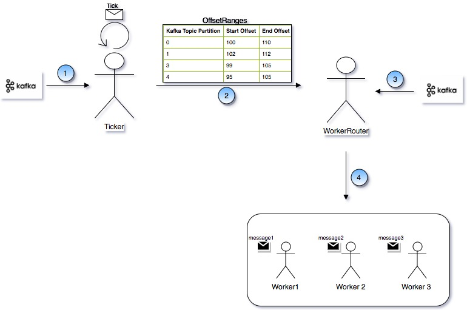

### Back Pressure and its benifits

Event based Applications whether they belong to LAMBDA Architecture or KAPPA Architecture need to have an important feature of back pressure. The reason is simple. If your processing rate is slower than messages getting produced, and the application keep on consuming the events then application will have all those messages in memory. Due to which following problems can happen:

1. This may become a reason for the application to crash because the of memory exceeding from a limit. Which will eventually become the reason to loose all events which have been consumed
2. Even if application is stopped in that case also all the messages will be lost.

So it is very much important, application should be able to limit the message in take rate, so that messages can reside at message source instead of getting consumed. This is called Back Pressure.

### Implementation of Back Pressure with AKKA Actor and Kafka



```markdown
Syntax highlighted code block

# 
## Header 2
### Header 3

- Bulleted
- List

1. Numbered
2. List

**Bold** and _Italic_ and `Code` text

[Link](url) and 
```

For more details see [GitHub Flavored Markdown](https://guides.github.com/features/mastering-markdown/).

### Jekyll Themes

Your Pages site will use the layout and styles from the Jekyll theme you have selected in your [repository settings](https://github.com/singhwarrior/my-blog/settings). The name of this theme is saved in the Jekyll `_config.yml` configuration file.

### Support or Contact

Having trouble with Pages? Check out our [documentation](https://help.github.com/categories/github-pages-basics/) or [contact support](https://github.com/contact) and we’ll help you sort it out.
